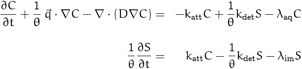

# VirusTransport_RxSandbox
**BIOPARTICLE**: a PFLOTRAN Reaction Sandbox for virus transport


***

## Conceptual Mode


**Mathematical description:**



***

## Tests
- Breakthrough curves from a column experiment: [Click me](https://github.com/edsaac/VirusTransport_RxSandbox/tree/master/test)

***

## Instructions

1. Add this new reaction sandbox (*BIOPARTICLE*) to PFLOTRAN's source folder.
```
cp src/reaction_sandbox_escPTr.F90  $PFLOTRAN_DIR/src/pflotran/reaction_sandbox_escPTr.F90
```
2. Replace the main reaction sandbox fortran file to include *BIOPARTICLE* as one of the options.
```
cp src/reaction_sandbox.F90  $PFLOTRAN_DIR/src/pflotran/reaction_sandbox.F90
```
3. Update dependencies.
```
python3 $PFLOTRAN_DIR/python/src/python/pflotran_depedencies.py
```
4. Compile PFLOTRAN code.
```
cd $PFLOTRAN_DIR/src/pflotran/
make pflotran
```

Details at https://bitbucket.org/pflotran/pflotran/wiki/Documentation/ReactionSandbox

***

## Doing right now?

>Trying to replicate results from this paper: 
>
>Sadeghi, G., Schijven, J.F., Behrends, T., Hassanizadeh, S.M., Gerritse, J. and Kleingeld, P.J. (2011), Systematic Study of Effects of pH and Ionic Strength on >Attachment of Phage PRD1. Groundwater, 49: 12-19. doi:10.1111/j.1745-6584.2010.00767.x
>
>http://doi.wiley.com/10.1111/j.1745-6584.2010.00767.x