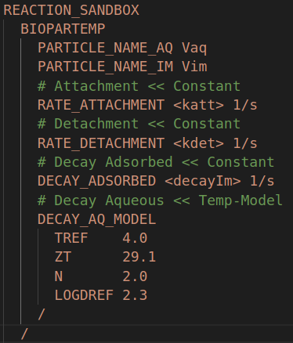

<link rel="shortcut icon" type="image/x-icon" href="./images/favicon.png">

# Instructions

## Compiling the reaction sandboxes 

### *BIOPARTICLE*

[](https://www.pflotran.org/)

1. Add this reaction sandbox to PFLOTRAN's source folder.
```
$ cp src/reactionSandbox/reaction_sandbox_escPTr.F90  $PFLOTRAN_DIR/src/pflotran/reaction_sandbox_escPTr.F90
```
2. Replace the main reaction sandbox fortran file to include this sandbox as one of the options.
```
$ sed '/Add new reaction sandbox classes here./a \ \ use Reaction_Sandbox_escPTr_class' reaction_sandbox_template.F90 > reaction_sandbox.F90

$ sed -i '/Add new cases statements for new reaction sandbox classes here./a \      case('BIOPARTICLE')\n\        new_sandbox => escPTr_Create()' reaction_sandbox.F90

$ cp src/reactionSandbox/reaction_sandbox.F90  $PFLOTRAN_DIR/src/pflotran/reaction_sandbox.F90
```
3. Add the reaction sandbox to the list of objects to compile
```
$ cd $PFLOTRAN_DIR/src/pflotran/
$ sed -i '/reaction_sandbox_simple.o/a \ \ \ \ \${common_src}reaction_sandbox_escPTr.o \\' pflotran_object_files.txt
```
4. Update dependencies.
```
$ cd $PFLOTRAN_DIR/src/pflotran/
$ python3 ../python/pflotran_depedencies.py
```
5. Compile PFLOTRAN code.
```
$ cd $PFLOTRAN_DIR/src/pflotran/
make pflotran
```

#### **How to use?**

The CHEMISTRY card should look something like this:

```
CHEMISTRY
  PRIMARY_SPECIES
    Vaq
  /
  
  IMMOBILE_SPECIES
    Vim
  /

  REACTION_SANDBOX
    BIOPARTICLE
      PARTICLE_NAME_AQ Vaq
      PARTICLE_NAME_IM Vim
      RATE_ATTACHMENT <katt> 1/s
      RATE_DETACHMENT <kdet> 1/s
      DECAY_AQUEOUS <decayAq> 1/s
      DECAY_ADSORBED <decayIm> 1/s
    /
  /
  TRUNCATE_CONCENTRATION 1.0E-35
  LOG_FORMULATION
  DATABASE database.dat
  OUTPUT
    TOTAL
    ALL
  /
END
```
___________

### *BIOPARTEMP*

[](https://www.pflotran.org/)

1. Add this reaction sandbox to PFLOTRAN's source folder.
```
$ cp src/reactionSandbox/reaction_sandbox_bioTH.F90  $PFLOTRAN_DIR/src/pflotran/reaction_sandbox_bioTH.F90
```
2. Replace the main reaction sandbox fortran file to include this sandbox as one of the options.
```
$ sed '/Add new reaction sandbox classes here./a \ \ use Reaction_Sandbox_bioTH_class' reaction_sandbox_template.F90 > reaction_sandbox.F90

$ sed -i '/Add new cases statements for new reaction sandbox classes here./a \      case('BIOPARTEMP')\n\        new_sandbox => bioTH_Create()' reaction_sandbox.F90

$ cp src/reactionSandbox/reaction_sandbox.F90  $PFLOTRAN_DIR/src/pflotran/reaction_sandbox.F90
```
3. Add the reaction sandbox to the list of objects to compile
```
$ cd $PFLOTRAN_DIR/src/pflotran/
$ sed -i '/reaction_sandbox_simple.o/a \ \ \ \ \${common_src}reaction_sandbox_bioTH.o \\' pflotran_object_files.txt
```
4. Update dependencies.
```
$ cd $PFLOTRAN_DIR/src/pflotran/
$ python3 ../python/pflotran_depedencies.py
```
5. Compile PFLOTRAN code.
```
$ cd $PFLOTRAN_DIR/src/pflotran/
make pflotran
```

#### **How to use?**

The CHEMISTRY card should look something like this:

```
CHEMISTRY
  PRIMARY_SPECIES
    Vaq
  /
  
  IMMOBILE_SPECIES
    Vim
  /

  REACTION_SANDBOX
    BIOPARTEMP
      PARTICLE_NAME_AQ Vaq
      PARTICLE_NAME_IM Vim
      RATE_ATTACHMENT <katt> 1/s
      RATE_DETACHMENT <kdet> 1/s
      DECAY_ADSORBED <decayIm> 1/s
      DECAY_AQ_MODEL
        TREF    4.0
        ZT      29.1
        N       2.0
        LOGDREF 2.3
      /
    /
  /
  TRUNCATE_CONCENTRATION 1.0E-35
  LOG_FORMULATION
  DATABASE database.dat
  OUTPUT
    TOTAL
    ALL
  /
END
```

## Installing the python API*

1. Add the package to your python installation using `pip`.
```
$ cd ./src/jupypft/

$ pip install -e .
```


***

### It worked when...

|Using|version|Link|
|--:|--:|--:|
|`PFLOTRAN`|`v3.0`|[](https://www.pflotran.org/)|
|`PETSc`|`v3.13`|[](https://www.mcs.anl.gov/petsc/)|
|`gfortran`|`7.5.0`|[](https://gcc.gnu.org/fortran/)|
|`make`|`4.1`|[](https://www.gnu.org/software/make/)|
|`Ubuntu`|`v18.04`|[](https://ubuntu.com/)|

***

**More details about compiling a new PFLOTRAN's reaction sandbox. >>** [&#128279;](https://bitbucket.org/pflotran/pflotran/wiki/Documentation/ReactionSandbox)

<a href="https://edsaac.github.io/bioparticle/">
	
</a>

<p align="right">
    
    
</p>