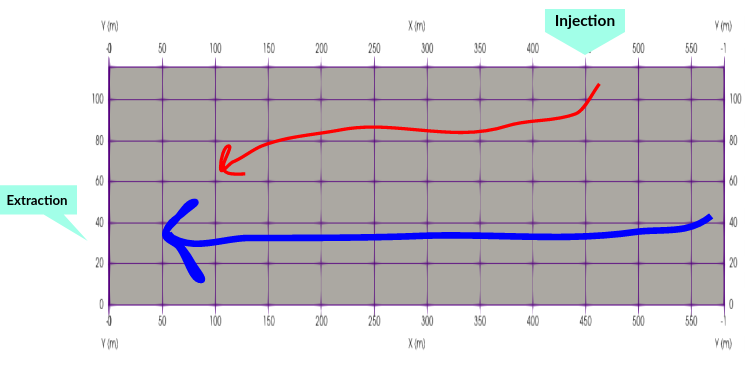
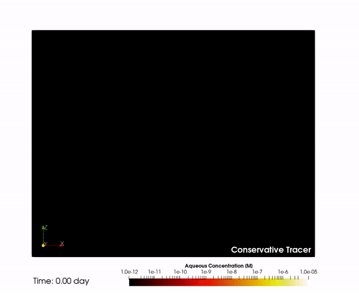
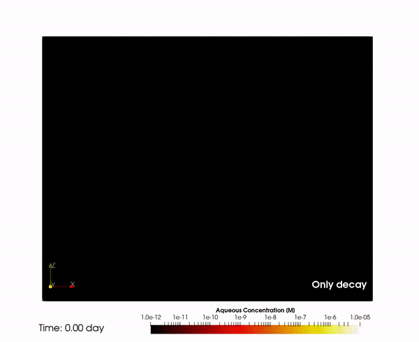
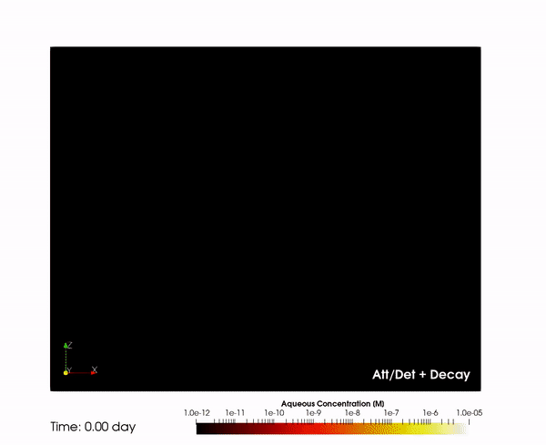

<link rel="shortcut icon" type="image/x-icon" href="../images/favicon.png">

# Setback distance of an extraction well from a contaminated leaking pipe 

<p align="right" style="font-size:10px;">
<a href="https://github.com/edsaac/bioparticle/tree/master/test/setbackDistanceWell">
	
</a>
</p>

### What is this experiment?
A leaking pipe near an extraction well.

### What does the code do?
`runSetbackWell.py` reads a CSV file with a list of cases to run in PFLOTRAN, allowing the variation of parameters that are pointed out in the template .IN file as follows:

```
  REACTION_SANDBOX
    BIOPARTICLE
      RATE_ATTACHMENT <katt> 1/s
      RATE_DETACHMENT <kdet> 1/s
    /
  /
```
the tags `<katt>` and `<kdet>` are replaced for the list of values indicated in the csv-file, in the column with the same header. 

### How to run this test?
```
$ python3 runSetbackWell.py [CSV_PARAMETERS] [TEMPLATE_FILE] 
```
Where:
- `[CASES.CSV]`: path to csv file with the list of parameters and the corresponding tags
- `[TEMPLATE.IN]`: input file template for PFLOTRAN and the corresponding tags

All cases listed in the CSV file will run in parallel: if four cases are given, four processes are started. This is different than splitting the domain of each single case and running it into <i>n</i> different processes. 

### References for this experiment:
- Schijven, J. F., Hassanizadeh, S. M., & de Roda Husman, A. M. (2010). Vulnerability of unconfined aquifers to virus contamination. Water Research, 44(4), 1170–1181. [](https://doi.org/10.1016/j.watres.2010.01.002)

<p>&nbsp;</p>

***

## Description

<p>
An injection of nanoparticles at a given concentration is set at a region on the top boundary of an aquifer. This injection last for five days, after that, clean water keeps leaking into the system.
At the left-side of the domain there is an extraction well extracting water at a constant rate. The right-side boundary of the aquifer is assumed open, assuming the water table is found at the surface. 
</p>




|Aquifer parameters | | Value | Unit |
|---|---|--:|:--|
|Lenght| *L* |580|m|
|Depth| *H* | 116|m|
|Permeability| *k*|1.0 × 10<sup>-10</sup>|m<sup>2</sup>|
|Porosity| *φ*|0.33|-|
|Long. Dispersivity| *α<sub>L</sub>*|0.015|cm|

<p>&nbsp;</p>

|Leaking parameters | | Value | Unit |
|---|---|--:|:--|
|Distance to well| *r<sub>s</sub>* |435|m|
|Leaking distance| *l<sub>s</sub>* |15|m|
|Leaking rate| *q<sub>l</sub>* |X|m/s|

<p>&nbsp;</p>

|Extraction well | | Value | Unit |
|---|---|--:|:--|
|Top elevation| *r<sub>s</sub>* |82.4|m|
|Bottom elevation | *H* |32.5|m|
|Flow rate| *Q<sub>e</sub>*|0.300|m<sup>3</sup>/d|

<p>&nbsp;</p>

***

## **List of parameters**

<p>&nbsp;</p>

<table>
	<thead>
	<tr>
		<th>Case</th>
	    <th>k<sub>att</sub></th>
        <th>k<sub>det</sub></th>
		<th>λ<sub>aq</sub></th>
		<th>λ<sub>im</sub></th>
	</tr>
	</thead>
	<tbody>
	<tr>
		<td>Conservative tracer</td>
		<td>0</td>
		<td>0</td>
		<td>0</td>
		<td>0</td>
	</tr>
	<tr>
		<td>Only decay</td>
		<td>0</td>
		<td>0</td>
		<td>5.0 × 10<sup>-3</sup></td>
		<td>0</td>
	</tr>
	<tr>
		<td>Only kinetic sorption</td>
		<td>5.0 × 10<sup>-2</sup></td>
		<td>1.0 × 10<sup>-2</sup></td>
		<td>0</td>
		<td>0</td>
	</tr>
	<tr>
		<td>Sorption + Decay</td>
		<td>5.0 × 10<sup>-2</sup></td>
		<td>1.0 × 10<sup>-2</sup></td>
		<td>5.0 × 10<sup>-3</sup></td>
		<td>1.0 × 10<sup>-2</sup></td>
	</tr>
	</tbody>
</table>

<p align="right">k and λ units in [d<sup>-1</sup>]</p>

***

## **PFLOTRAN Simulation**








<p>&nbsp;</p>

_______

<a href="https://edsaac.github.io/bioparticle/listTests.html">
	
</a>

<p align="right">
    
    
</p>
