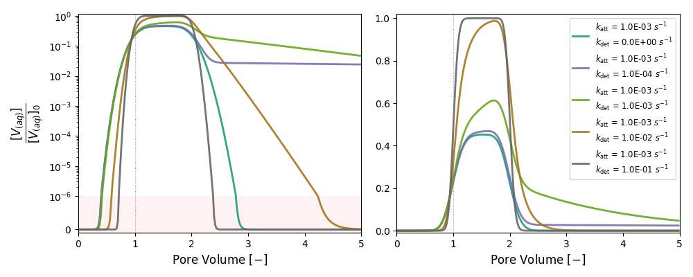

# Kinetic attachment/detachment continuum-based models for nanoparticles transport in porous media

**What is this experiment?**<br>
It simulates breakthrough curves of nanoparticles for attachment and detachment rates that span several orders of magnitude.

**What does the code do?**<br>
`runMultipleCases.py` reads a CSV file with a list of cases to run in PFLOTRAN, allowing the variation of parameters that are pointed out in the template .IN file as follows:

```
  REACTION_SANDBOX
    BIOPARTICLE
      RATE_ATTACHMENT <katt> 1/s
      RATE_DETACHMENT <kdet> 1/s
    /
  /
```
the tags `<katt>` and `<kdet>` are replaced for the list of values indicated in the csv-file, in the column with the same header. 

**How to run this test?**<br>
```
$ python3 runTableCases.py [CSV_PARAMETERS] [TEMPLATE_FILE] -run
```
Where:
- `[CASES.CSV]`: path to csv file with the list of parameters and the corresponding tags
- `[TEMPLATE.IN]`: input file template for PFLOTRAN and the corresponding tags


**More details of this experiment:** <br>
- Babakhani, P., Bridge, J., Doong, R., & Phenrat, T. (2017). Continuum-based models and concepts for the transport of nanoparticles in saturated porous media: A state-of-the-science review. Advances in Colloid and Interface Science, 246, 75–104.  [](http://dx.doi.org/10.1016/j.cis.2017.06.002)

- Babakhani, P., Fagerlund, F., Shamsai, A., Lowry, G. V., & Phenrat, T. (2015). Modified MODFLOW-based model for simulating the agglomeration and transport of polymer-modified Fe0 nanoparticles in saturated porous media. Environmental Science and Pollution Research, 25(8), 7180–7199. [](http://link.springer.com/10.1007/s11356-015-5193-0)
<p>&nbsp;</p>

***

## Description

[Picture for the experiment with dimensions]

<p>
An injection of nanoparticles at a given concentration is set at the inlet of a column experiment. After some time, the nanoparticle injection is stopped and only clean water keeps runing through the column. 
</p>

|Column parameters | | Value | Unit |
|---|---|--:|:--|
|Lenght| *L* |25.5|cm|
|Diameter| *Ø* | 1.27|cm|
|Grain size| *d<sub>50</sub>*|0.300|mm|
|Porosity| *φ*|0.33|-|
|Long. Dispersivity| *α<sub>L</sub>*|0.015|cm|

<p>&nbsp;</p>

|Particle parameters | | Value | Unit |
|---|---|--:|:--|
|Size | *d<sub>p</sub>*| ?? | nm |
|Initial concentration| *C<sub>0</sub>*| 1.0 × 10<sup>-5</sup>|mol/L|

<p>&nbsp;</p>

***

## **List of parameters**

<p>&nbsp;</p>

<table class="demo">
	<thead>
	<tr>
		<th>Set<br></th>
		<th>Case</th>
	  <th>k<sub>att</sub></th>
    <th>k<sub>det</sub></th>
	</tr>
	</thead>
	<tbody>
	<tr>
		<td rowspan=5>Only Attachment <br></td>
    <td>&nbsp;1</td>
		<td>&nbsp;0</td>
		<td>&nbsp;0</td>
	</tr>
	<tr>
		<td>&nbsp;2</td>
		<td>1.0 × 10<sup>-4</sup></td>
		<td>&nbsp;0</td>
	</tr>
	<tr>
		<td>&nbsp;3</td>
		<td>5.0 × 10<sup>-4</sup></td>
		<td>&nbsp;0</td>
	</tr>
	<tr>
		<td>&nbsp;4</td>
		<td>1.0 × 10<sup>-3</sup></td>
		<td>&nbsp;0</td>
	</tr>
	<tr>
		<td>&nbsp;5</td>
		<td>1.0 × 10<sup>-2</sup></td>
		<td>&nbsp;0</td>
	</tr>
	<tbody>
</table>
<p>&nbsp;</p>
<table class="demo">
	<thead>
	<tr>
		<th>Set<br></th>
		<th>Case</th>
	  <th>k<sub>att</sub></th>
    <th>k<sub>det</sub></th>
	</tr>
	</thead>
	<tbody>
	<tr>
		<td rowspan=5>Vary detachment <br></td>
    <td>&nbsp;1</td>
		<td>1.0 × 10<sup>-3</sup></td>
    <td>&nbsp;0</td>
	</tr>
	<tr>
		<td>&nbsp;2</td>
		<td>1.0 × 10<sup>-3</sup></td>
		<td>1.0 × 10<sup>-4</sup></td>
	</tr>
	<tr>
		<td>&nbsp;3</td>
		<td>1.0 × 10<sup>-3</sup></td>
		<td>1.0 × 10<sup>-3</sup></td>
	</tr>
	<tr>
		<td>&nbsp;4</td>
		<td>1.0 × 10<sup>-3</sup></td>
		<td>1.0 × 10<sup>-2</sup></td>
	</tr>
	<tr>
		<td>&nbsp;5</td>
		<td>1.0 × 10<sup>-3</sup></td>
		<td>1.0 × 10<sup>-1</sup></td>
	</tr>
	<tbody>
</table>

> k and λ units in [s<sup>-1</sup>]

<p>&nbsp;</p>


***

## **Published results**

[Insert citation here]
<p>&nbsp;</p>

***

## **PFLOTRAN Simulation**




<p>&nbsp;</p>

_______

<a href="https://edsaac.github.io/bioparticle/listTests.html">
	
</a>

<p align="right">
    
    
</p>
