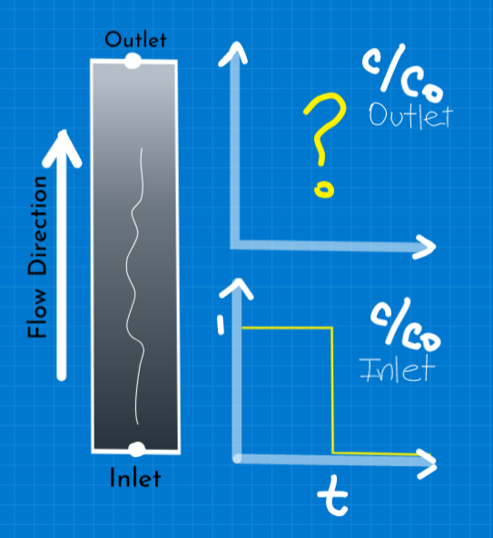
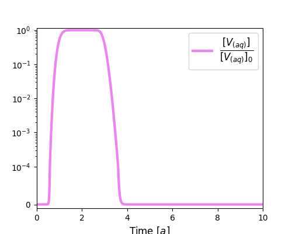
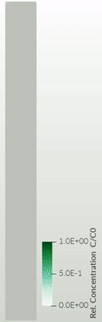
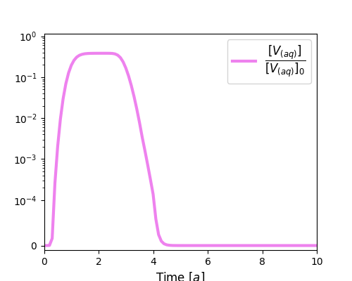
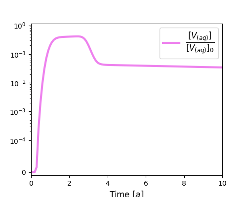
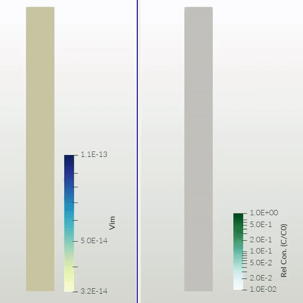
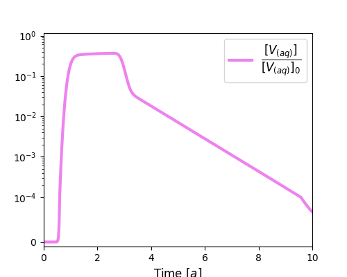

# Breakthrough curves from a column experiment

**What is a breakthrough curve?** 
It's a plot of concentration at some point over time

**What is a column experiment?** 
A fluid with some solute concentration is injected at one end of a cilyndrical soil sample and its concentration is registered at the other end. 

**More details at:**  

&nbsp;

***

## Description

	

An injection of some bioparticle (e.g. a virus) concentration is set at the inlet of a column experiment. The bioparticle can either attach to the solid matrix, dettach and reenter the aqueous phase, and decay into another species. After some time, the bioparticle injection is stopped and only clean water keeps runing through the column. 

|Column parameters | | Value | Unit |
|---|---|--:|:--|
|Lenght| *L* |50|cm|
|Diameter| *Ø* | 5|cm|
|Darcy flow| *q* |2.05|cm/h|
|Porosity| *φ* |0.37|-|
|Grain size| *d50*|0.44|mm|

&nbsp;

|Particle parameters | | Value | Unit |
|---|---|--:|:--|
|Size | *dp*| 62 | nm |
|Isoelectric point| *IEP*| ~ 3.5| - |
|Initial concentration| *C0*| 1.66 × 10-16|mol/L|

&nbsp;

***

## **Plug flow case**

|Parameter | | Value | Unit |
|---|---|--:|:--|
|Long. dispersion coefficient| *αL* |0 |cm|
|Attachment rate| *katt* |0|1/s|
|Detachment rate| *kdet* |0|1/s|
|Decay while in aqueous phase| *λaq* |0|1/s|
|Decay while adsorbed to solid phase| *λim* |0|1/s|

&nbsp;

**Results**

***

## **With longitudinal dispersion**

|Parameter | | Value | Unit |
|---|---|--:|:--|
|Long. dispersion coefficient| *αL* |0.2 |cm|
|Attachment rate| *katt* |0|1/s|
|Detachment rate| *kdet* |0|1/s|
|Decay while in aqueous phase| *λaq* |0|1/s|
|Decay while adsorbed to solid phase| *λim* |0|1/s|

&nbsp;

**Results**

***

## **Only attachment (sink)**
|Parameter | | Value | Unit |
|---|---|--:|:--|
|Long. dispersion coefficient| *αL* |0.2 |cm|
|Attachment rate| *katt* |1.11 × 10-5|1/s|
|Detachment rate| *kdet* |0|1/s|
|Decay while in aqueous phase| *λaq* |0|1/s|
|Decay while adsorbed to solid phase| *λim* |0|1/s|

&nbsp;

**Results**

 

***

## **Attachment & detachment (source + sink)**
|Parameter | | Value | Unit |
|---|---|--:|:--|
|Long. dispersion coefficient| *αL* |0.2 |cm|
|Attachment rate| *katt* |1.11 × 10-5|1/s|
|Detachment rate| *kdet* |7.22 × 10-7|1/s|
|Decay while in aqueous phase| *λaq* |0|1/s|
|Decay while adsorbed to solid phase| *λim* |0|1/s|

&nbsp;

**Results**

***

## **Attachment, detachment & decay**
|Parameter | | Value | Unit |
|---|---|--:|:--|
|Long. dispersion coefficient| *αL* |0.2 |cm|
|Attachment rate| *katt* |1.11 × 10-5|1/s|
|Detachment rate| *kdet* |7.22 × 10-7|1/s|
|Decay while in aqueous phase| *λaq* |1.94 × 10-6|1/s|
|Decay while adsorbed to solid phase| *λim* |9.72 × 10-6|1/s|

&nbsp;

**Results**

_______

