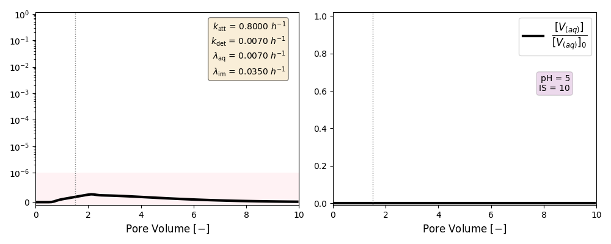
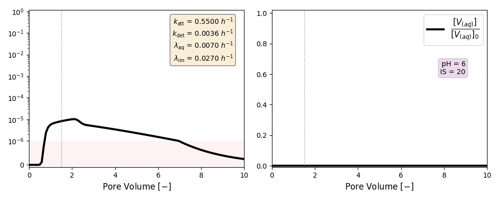

# One-site kinetic attachment of Phage PRD1

<p align="right" style="font-size:10px;">
<a href="https://github.com/edsaac/bioparticle/tree/master/test/phagesExperiment">
	
</a>
</p>

**What is this experiment?**<br>
Column experiment for the transport (adsorption/decay) of a non-enveloped virus in a saturated porous media.

**What does the code do?**<br>
`runTableCases.py` recieves a csv-file with the list of cases to be executed and a template file for the input PFLOTRAN. The template has tags where values will be replaced by the ones indicated in the csv-file. For example, in the template file

```
  REACTION_SANDBOX
    BIOPARTICLE
      RATE_ATTACHMENT <katt> 1/h
    /
  /
```
the tag `<katt>` is replaced for the list of values indicated in the csv-file, in the column with the same header. 

**How to run this test?**<br>
```
python3 runTableCases.py [CSV_PARAMETERS] [TEMPLATE_FILE] -run
```

**More details of the real experiment:** <br>
> Sadeghi, G., Schijven, J.F., Behrends, T., Hassanizadeh, S.M., Gerritse, J. and Kleingeld, P.J. (2011), Systematic Study of Effects of pH and Ionic Strength on >Attachment of Phage PRD1. Groundwater, 49: 12-19. [](https://doi.org/10.1111/j.1745-6584.2010.00767.x)
>

<p>&nbsp;</p>

***

## Description

[Picture for the experiment with dimensions]

<p>
An injection of an infective virus (PRD1) at a given concentration is set at the inlet of a column experiment. The virus can either attach to the quartz matrix, dettach and re-enter the aqueous phase, and decay and lose infectivity. After some time, the bioparticle injection is stopped and only clean water keeps runing through the column. 
</p>

|Column parameters | | Value | Unit |
|---|---|--:|:--|
|Lenght| *L* |50|cm|
|Diameter| *Ø* | 5|cm|
|Grain size| *d<sub>50</sub>*|0.44|mm|

<p>&nbsp;</p>

|Particle parameters | | Value | Unit |
|---|---|--:|:--|
|Size | *d<sub>p</sub>*| 62 | nm |
|Initial concentration| *C<sub>0</sub>*| 1.66 × 10<sup>-16</sup>|mol/L|

<p>&nbsp;</p>

***

## **List of parameters**

<table>
<tbody>
<tr>
<td style="text-align: right;">IS</td>
<td>pH</td>
<td>Folder</td>
<td>k<sub>att</sub></td>
<td>k<sub>det</sub></td>
<td>λ<sub>aq</sub></td>
<td>λ<sub>im</sub></td>
</tr>
<tr>
<td rowspan="4">1</td>
<td>8</td>
<td><code>./CASE_001</code></td>
<td>0.0045</td>
<td>0.2000</td>
<td>0.003</td>
<td>0.015</td>
</tr>
<tr>
<td>7</td>
<td><code>./CASE_002</code></td>
<td>0.0410</td>
<td>0.0019</td>
<td>0.005</td>
<td>0.025</td>
</tr>
<tr>
<td>6</td>
<td><code>./CASE_003</code></td>
<td>0.0700</td>
<td>0.0009</td>
<td>0.004</td>
<td>0.025</td>
</tr>
<tr>
<td>5</td>
<td><code>./CASE_004</code></td>
<td>0.1100</td>
<td>0.0031</td>
<td>0.006</td>
<td>0.035</td>
</tr>
<tr>
<td rowspan="4">10</td>
<td>8</td>
<td><code>./CASE_005</code></td>
<td>0.0380</td>
<td>0.0036</td>
<td>0.007</td>
<td>0.040</td>
</tr>
<tr>
<td>7</td>
<td><code>./CASE_006</code></td>
<td>0.0400</td>
<td>0.0026</td>
<td>0.007</td>
<td>0.035</td>
</tr>
<tr>
<td>6</td>
<td><code>./CASE_007</code></td>
<td>0.1400</td>
<td>0.0030</td>
<td>0.007</td>
<td>0.035</td>
</tr>
<tr>
<td>5</td>
<td><code>./CASE_008</code></td>
<td>0.8000</td>
<td>0.0070</td>
<td>0.007</td>
<td>0.035</td>
</tr>
<tr>
<td rowspan="4">20</td>
<td>8</td>
<td><code>./CASE_009</code></td>
<td>0.1100</td>
<td>0.0045</td>
<td>0.007</td>
<td>0.027</td>
</tr>
<tr>
<td>7</td>
<td><code>./CASE_010</code></td>
<td>0.2100</td>
<td>0.0140</td>
<td>0.007</td>
<td>0.027</td>
</tr>
<tr>
<td>6</td>
<td><code>./CASE_011</code></td>
<td>0.5500</td>
<td>0.0036</td>
<td>0.007</td>
<td>0.027</td>
</tr>
<tr>
<td>5</td>
<td><code>./CASE_012</code></td>
<td>2.0800</td>
<td>0.0000</td>
<td>0.007</td>
<td>0.035</td>
</tr>
</tbody>
</table>

> k and λ units in [h<sup>-1</sup>]

<p>&nbsp;</p>


***

## **Published results**

[Insert citation here]
<p>&nbsp;</p>

***

## **PFLOTRAN Simulation**








_______

<a href="https://edsaac.github.io/bioparticle/listTests.html">
	
</a>

<p align="right">
    
    
</p>