# One-site kinetic attachment of Phage PRD1

**What is this experiment?**<br>
Column experiment for the transport (adsorption/decay) of a non-enveloped virus in a saturated porous media.

**What does the code do?**<br>
`runTableCases.py` recieves a csv-file with the list of cases to be executed and a template file for the input PFLOTRAN. The template has tags where values will be replaced by the ones indicated in the csv-file. For example, in the template file

```
  REACTION_SANDBOX
    BIOPARTICLE
      RATE_ATTACHMENT <katt> 1/h
    /
  /
```
the tag `<katt>` is replaced for the list of values indicated in the csv-file, in the column with the same header. 

**How to run this test?**<br>
```
python3 runTableCases.py [CSV_PARAMETERS] [TEMPLATE_FILE] -run
```

**More details of the real experiment:** <br>
[](http://doi.wiley.com/10.1111/j.1745-6584.2010.00767.x)

<p>&nbsp;</p>
***

## Description

[Picture for the experiment with dimensions]
<p align="center">
	
</p>

<p>
An injection of an infective virus (PRD1) at a known concentration is set at the inlet of a column experiment. The virus can either attach to the quartz matrix, dettach and reenter the aqueous phase, and decay and lose infectivity. After some time, the bioparticle injection is stopped and only clean water keeps runing through the column. 
</p>

|Column parameters | | Value | Unit |
|---|---|--:|:--|
|Lenght| *L* |50|cm|
|Diameter| *Ø* | 5|cm|
|Grain size| *d<sub>50</sub>*|0.44|mm|

<p>&nbsp;</p>

|Particle parameters | | Value | Unit |
|---|---|--:|:--|
|Size | *d<sub>p</sub>*| 62 | nm |
|Initial concentration| *C<sub>0</sub>*| 1.66 × 10<sup>-16</sup>|mol/L|

<p>&nbsp;</p>

***

## **List of parameters**

[Insert table with list of 12 cases]
<p>&nbsp;</p>


***

## **Published results**

[Insert citation here]
<p>&nbsp;</p>

***

## **PFLOTRAN Simulation**

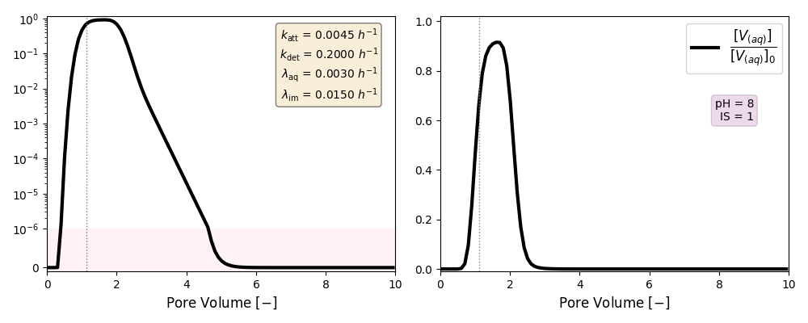
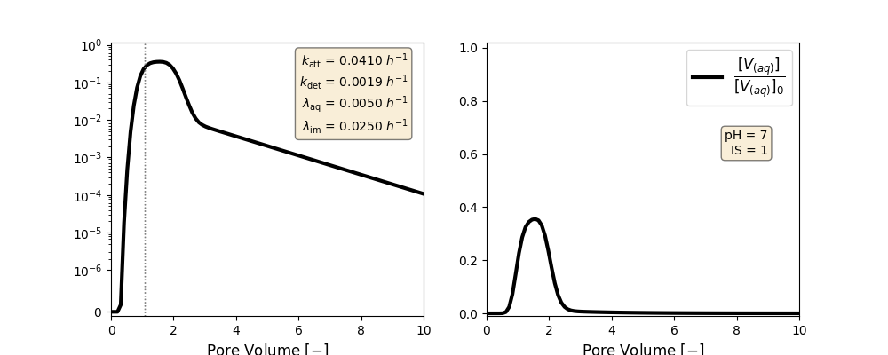
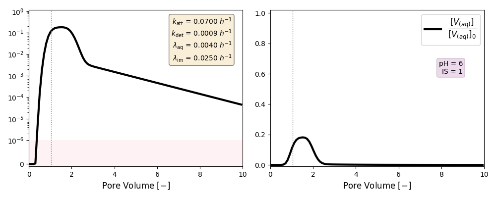
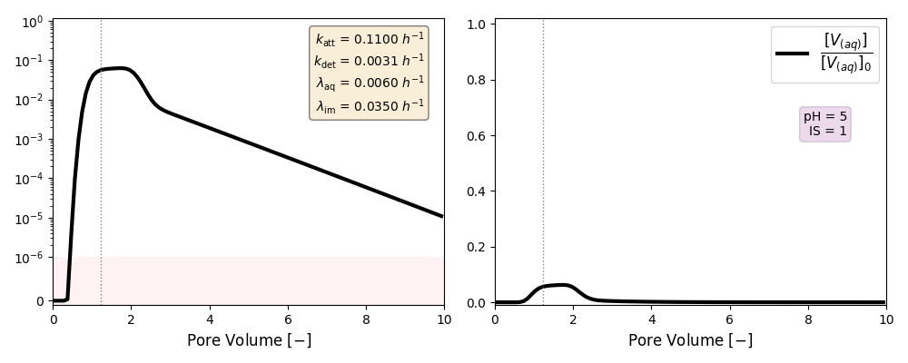
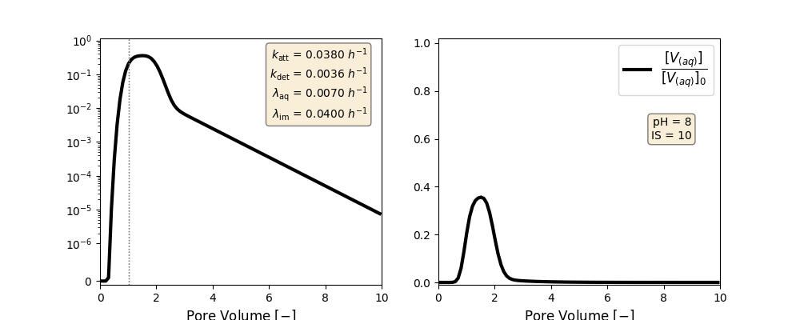
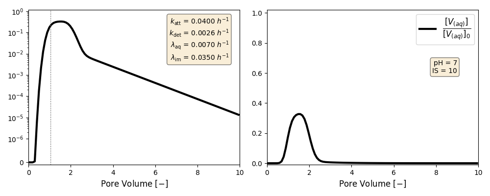
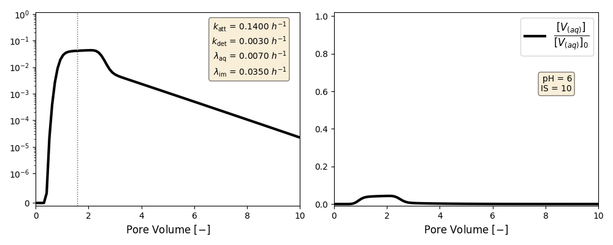
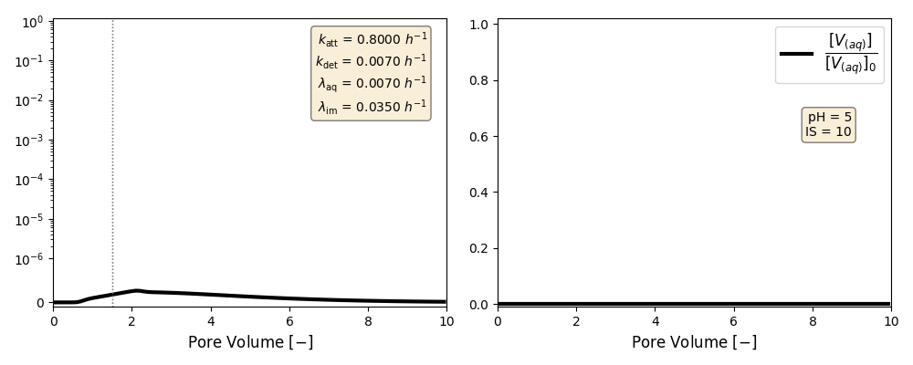
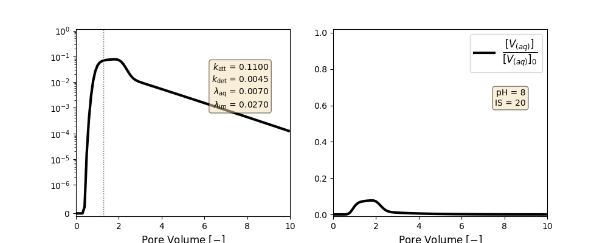
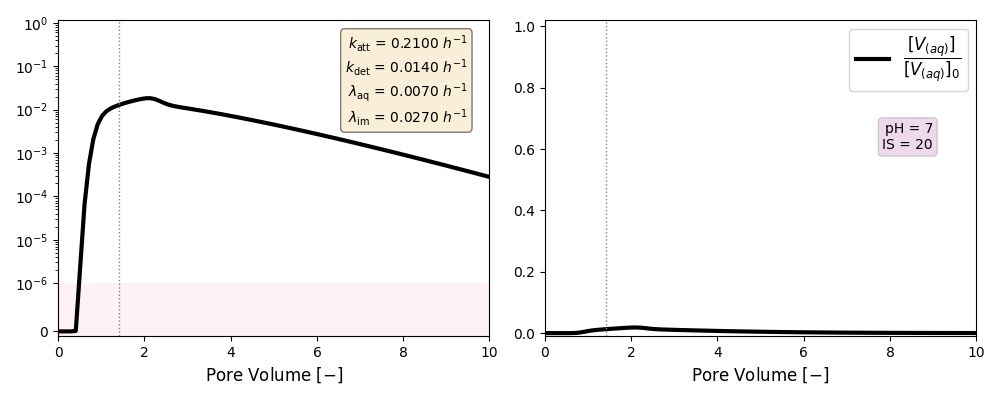
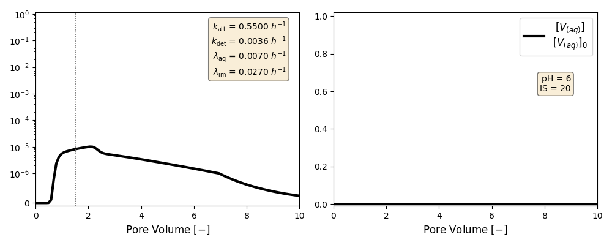

_______

[]()
